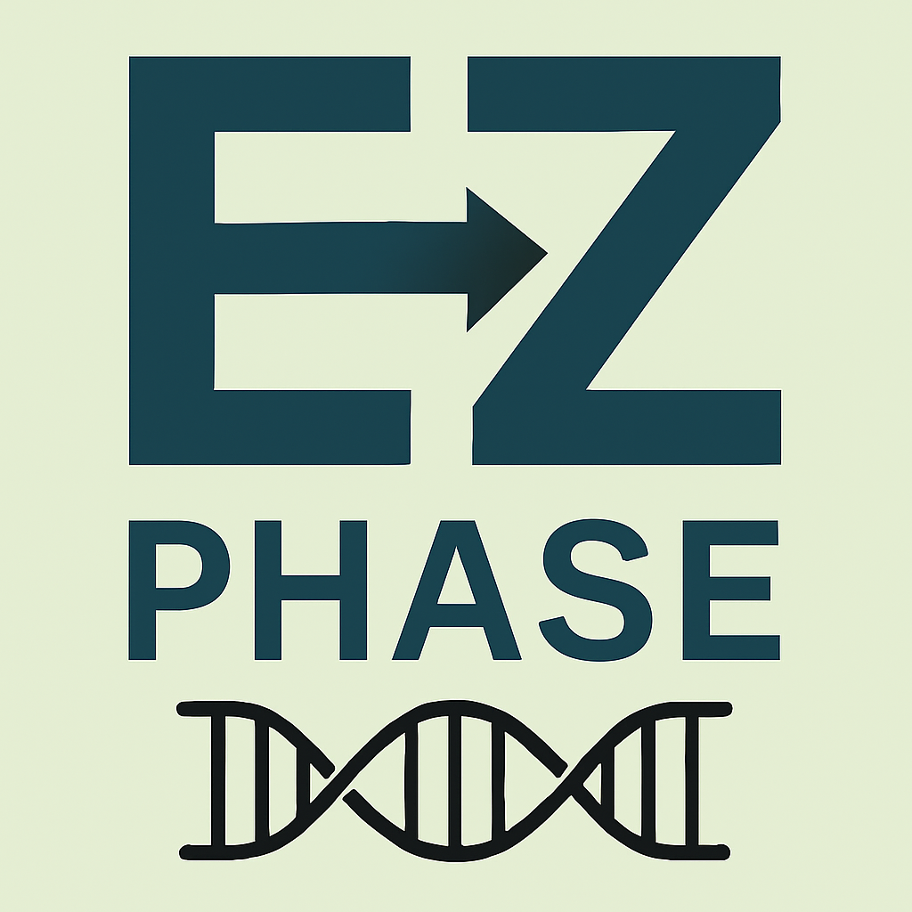

# EZ-PHASE v1.10

**Easy Haplotype Phasing - Advanced GUI for PHASE 2.1.1**

A modern, user-friendly graphical interface for the PHASE haplotype reconstruction software, featuring enhanced file management, parallel processing, and advanced parameter control.



## 🌟 Features

### Core Functionality
- **Intuitive GUI** for PHASE 2.1.1 haplotype phasing
- **Batch Processing** - Handle multiple .inp files simultaneously  
- **Real-time Progress Tracking** with file-by-file status updates
- **Advanced Parameter Control** - Full access to PHASE options including:
  - Recombination models (MR0, MR1, MR2, MR3, MR4)
  - Mutation models for multi-allelic loci
  - Custom priors and thresholds
  - Hotspot detection and analysis

### Enhanced Workflow
- **Parallel Processing** with auto-detection of optimal thread count
- **Smart File Management** with status indicators (pending/processing/completed/error)
- **Process Control** - Start, stop, and monitor PHASE executions
- **Command Preview** - See exactly what commands will be executed
- **Comprehensive Output** - Organized results with detailed logging

### User Experience
- **Cross-platform** support (macOS, Windows, Linux)
- **No Installation Required** for PHASE binary - specify your own
- **Modern Interface** with responsive design and real-time feedback
- **Error Handling** with informative messages and recovery options

## 📋 Requirements

- **PHASE 2.1.1** binary (download separately from [Stephens Lab](http://stephenslab.uchicago.edu/phase/download.html))
- **Operating System**: macOS 10.14+, Windows 10+, or Linux (Ubuntu 18.04+)
- **Memory**: 4GB RAM minimum (8GB+ recommended for large datasets)

## 📦 Installation

### Download Pre-built Binaries

**Latest Release: [v1.10.0](https://github.com/JSBarrington/ez-phase/releases/latest)**

| Platform | Download | Instructions |
|----------|----------|--------------|
| **macOS** | [EZ-PHASE-1.10.0.dmg](https://github.com/JSBarrington/ez-phase/releases/latest) | Download, mount, and drag to Applications |
| **Windows** | [EZ-PHASE Setup 1.10.0.exe](https://github.com/JSBarrington/ez-phase/releases/latest) | Download and run installer |
| **Linux** | [EZ-PHASE-1.10.0.AppImage](https://github.com/JSBarrington/ez-phase/releases/latest) | Download, make executable, and run |

### First Launch

1. **Download PHASE 2.1.1** from the [official source](http://stephenslab.uchicago.edu/phase/download.html)
2. **Launch EZ-PHASE** and use "Browse" to locate your PHASE binary
3. **Select your .inp files** and configure parameters
4. **Run analysis** with real-time monitoring

## 🚀 Quick Start

### Basic Workflow
1. **Select PHASE Binary** - Browse to your PHASE 2.1.1 executable
2. **Choose Input Files** - Select one or more .inp files for analysis
3. **Configure Parameters** - Set iterations, burn-in, advanced options
4. **Review Command** - Check the generated command preview
5. **Execute** - Run with real-time progress tracking

### Advanced Features
- **Parallel Processing**: Set thread count or use auto-detection
- **Recombination Models**: Choose from MR0-MR4 based on your data
- **Hotspot Analysis**: Detect and analyze recombination hotspots
- **Custom Parameters**: Fine-tune priors, thresholds, and mutation models

## 📊 Input File Format

EZ-PHASE supports standard PHASE input format:

```
NumberOfIndividuals
NumberOfLoci
P Position(1) Position(2) ... Position(NumberOfLoci)
LocusType(1) LocusType(2) ... LocusType(NumberOfLoci)
ID(1)
Genotype(1) row 1
Genotype(1) row 2
ID(2)
Genotype(2) row 1
Genotype(2) row 2
...
```

- **S** = SNP/biallelic locus
- **M** = Microsatellite/multi-allelic locus
- **Missing data**: `?` for SNPs, `-1` for microsatellites

## 🔧 Development

### Building from Source

```bash
# Clone repository
git clone https://github.com/JSBarrington/ez-phase.git
cd ez-phase

# Install dependencies
npm install

# Run development version
npm start

# Build for all platforms
npm run build-all
```

### Project Structure
```
ez-phase/
├── main.js              # Electron main process
├── renderer.js          # Frontend logic
├── preload.js           # IPC bridge
├── index.html           # Main interface
├── package.json         # Project configuration
└── assets/             # Icons and resources
```

## 📈 What's New in v1.10

### Major Enhancements
- **Enhanced File Management** with visual status tracking
- **Improved Process Control** with robust stop/cancel functionality
- **Auto-detect Parallel Processing** for optimal performance
- **Advanced Parameter UI** with full MR model support
- **Real-time Progress Updates** with per-file status
- **Better Error Handling** and recovery mechanisms

### Technical Improvements
- More reliable process management and cleanup
- Enhanced cross-platform compatibility
- Improved memory usage for large datasets
- Better handling of PHASE output parsing
- Streamlined build and distribution pipeline

## 📚 Documentation

- **PHASE Manual**: See included PDF documentation for PHASE 2.1.1 parameters
- **Input Format**: Detailed specifications in the [PHASE documentation](http://stephenslab.uchicago.edu/phase/instruct2.1.pdf)
- **Parameter Guide**: Comprehensive parameter explanations in the GUI tooltips

## 🤝 Contributing

Contributions welcome! Please see our [contribution guidelines](CONTRIBUTING.md) and:

1. Fork the repository
2. Create a feature branch (`git checkout -b feature/amazing-feature`)
3. Commit changes (`git commit -m 'Add amazing feature'`)
4. Push to branch (`git push origin feature/amazing-feature`)
5. Open a Pull Request

## 📄 License

This project is licensed under the MIT License - see the [LICENSE](LICENSE) file for details.

**Note**: PHASE 2.1.1 is separate software with its own license terms. Please review the PHASE license for commercial use restrictions.

## 🙏 Acknowledgments

- **Matthew Stephens** and colleagues for developing PHASE
- **Stephens Lab** at University of Chicago for maintaining PHASE
- **Electron Community** for the excellent application framework
- **Bioinformatics Community** for feedback and testing

## 📞 Support

- **Issues**: [GitHub Issues](https://github.com/JSBarrington/ez-phase/issues)
- **Discussions**: [GitHub Discussions](https://github.com/JSBarrington/ez-phase/discussions)
- **Email**: jsbarrington@github.com

## 📊 Citation

If you use EZ-PHASE in your research, please cite:

```
Barrington, J.S. (2024). EZ-PHASE: A Modern GUI for PHASE Haplotype Reconstruction. 
GitHub repository: https://github.com/JSBarrington/ez-phase
```

And the original PHASE software:
```
Stephens, M., Smith, N.J., and Donnelly, P. (2001). A new statistical method for 
haplotype reconstruction from population data. American Journal of Human Genetics, 68, 978–989.
```

---

<<<<<<< HEAD
**Made with ❤️ for the bioinformatics community**
**⭐ Star this repository if EZ-PHASE helps your research!**
